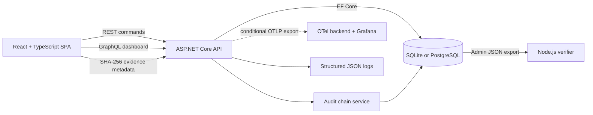

# CaseLedger

CaseLedger is a collaborative case and evidence workspace with a tamper-evident activity trail. It combines a responsive React interface, an ASP.NET Core API, REST commands, a GraphQL dashboard, relational persistence, and an independent Node.js audit verifier.

## Live demo

[Open the hosted CaseLedger demo](https://caseledger-demo.onrender.com)

Sign in with the shared analyst account:

- Email: `analyst@caseledger.dev`
- Password: `Analyst123!`

The free Render service may take about a minute to wake after inactivity. The hosted administrator credential remains private.


## What it demonstrates

- React 19 and TypeScript 6 with responsive, accessible workflow states
- ASP.NET Core 10 minimal APIs with cookie authentication and role authorization
- REST for case commands and GraphQL for dashboard aggregation
- EF Core with zero-configuration SQLite locally and PostgreSQL migrations for hosted deployments
- Page-based case queries and strong ETag optimistic concurrency for updates
- SHA-256 chained audit events with immutable tracked history
- Browser-side evidence hashing without retaining uploaded file contents
- An independent, dependency-free Node.js 24 audit verifier
- Vitest, React Testing Library, and jsdom component tests for client workflows and accessible interactions
- OpenAPI documentation plus OpenTelemetry traces, metrics, and structured JSON logs
- API integration and Playwright browser tests covering real workflows, PostgreSQL, and deliberate audit tampering

## Run locally

Prerequisites:

- [.NET 10 SDK](https://dotnet.microsoft.com/download/dotnet/10.0)
- [Node.js 24 or newer](https://nodejs.org/)

From the repository root:

```powershell
npm run setup
npm run dev
```

Open `http://localhost:5173`. The API listens on `http://localhost:5150`; its Swagger UI is at
`http://localhost:5150/swagger`, and the OpenAPI JSON document is at
`http://localhost:5150/swagger/v1/swagger.json`. The first run creates and seeds a local SQLite
database automatically.

| Role | Email | Password | Access |
| --- | --- | --- | --- |
| Analyst | `analyst@caseledger.dev` | `Analyst123!` | Standard case workflows |
| Administrator | `admin@caseledger.dev` | `Admin123!` locally; `Seed__AdminPassword` when hosted | Standard workflows and audit export |

These accounts are deterministic demonstration credentials, not a production identity design. Hosted deployments must provide a private `Seed__AdminPassword`; the public login screen only fills the shared analyst account.

## Core workflow

1. Sign in as an analyst or administrator.
2. Search, filter, create, assign, and update cases.
3. Add comments that become immutable activity events.
4. Register evidence metadata after the browser computes its SHA-256 digest.
5. Verify an individual case's complete activity chain.
6. Export an audit chain as an administrator and verify it independently with Node.js.


<p align="center">
  
</p>

## Architecture



REST owns mutations and detailed case reads. GraphQL has one focused purpose: assembling dashboard counts, recent cases, and the workspace integrity signal. This keeps the two API styles justified instead of duplicating the same surface.

### Audit chain

Every case mutation appends an event with a deterministic canonical payload:

```text
hash = SHA-256(previousHash + "\n" + canonicalData)
genesis previousHash = 64 zeroes
```

Each event records its sequence, previous hash, hash, actor, timestamp, event type, description, and canonical data. The API rejects tracked updates or deletes of audit rows. Verification also checks that canonical data still matches the visible event fields. The Node.js tool independently checks sequence continuity, every link, and every stored hash.

See [architecture.md](docs/architecture.md) for the data model, trust boundary, and design decisions.

## API surface

| Method | Route | Purpose |
| --- | --- | --- |
| `POST` | `/api/auth/login` | Create an HTTP-only cookie session |
| `GET` | `/api/auth/me` | Return the signed-in user |
| `POST` | `/api/auth/logout` | End the session |
| `GET` | `/api/users` | List assignable users |
| `GET` / `POST` | `/api/cases` | Page and search cases, or create one |
| `GET` / `PATCH` | `/api/cases/{id}` | Read one case or update its current version |
| `POST` | `/api/cases/{id}/comments` | Append a comment event |
| `POST` | `/api/cases/{id}/evidence` | Register evidence metadata and digest |
| `GET` | `/api/cases/{id}/audit` | Read the activity chain |
| `GET` | `/api/cases/{id}/audit/verify` | Recalculate and verify the chain |
| `GET` | `/api/cases/{id}/audit/export` | Export a chain; administrators only |
| `POST` | `/graphql` | Query dashboard aggregates |
| `GET` | `/health` | Anonymous health probe |
| `GET` | `/swagger` | Interactive Swagger UI |
| `GET` | `/swagger/v1/swagger.json` | OpenAPI v1 JSON document |

### Paging and concurrent updates

`GET /api/cases` accepts `page` (one-based, default 1) and `pageSize` (1–100, default 50). Its response contains
`items`, `total`, `page`, `pageSize`, `totalPages`, `hasNextPage`, and `hasPreviousPage`.
Search, status, and severity filters compose with paging; the React client returns to page one
when a filter changes.

Case list and detail projections include a GUID `version`. Detail reads, creates, and successful
updates also return a strong ETag. A `PATCH` must echo the current version as a quoted strong
precondition:

```http
If-Match: "11111111-1111-1111-1111-111111111111"
```

A missing header returns `428 Precondition Required`; a malformed, weak, or otherwise invalid
header returns `400 Bad Request`; and a superseded version returns `412 Precondition Failed`
with the latest ETag. The client never retries a stale mutation automatically: it explains the
conflict and reloads the latest case representation.

Example dashboard query:

```graphql
query Dashboard {
  dashboard {
    totalCases
    openCases
    criticalCases
    resolvedCases
    integrityStatus
    recentCases {
      id
      reference
      title
      status
      severity
      updatedAt
    }
  }
}
```

Validation and authorization failures use Problem Details JSON.

## Independent audit verification

Export a case audit as an administrator, then run:

```powershell
npm run verify --prefix tools/audit-verifier -- path/to/audit-export.json
```

A valid file prints the event count and chain head. Changed content, missing or reordered sequences, broken links, malformed fields, and mismatched hashes produce a nonzero exit code.

## Verification

Install dependencies once, then run the fast repository checks:

```powershell
npm ci
npm ci --prefix apps/web
npm run check
```

That single command runs:

- TypeScript lint and a production frontend build
- Vitest/React Testing Library component and API-client tests in jsdom
- .NET build plus API contract, lifecycle, telemetry, rate-limiting, and tampering tests
- Independent Node.js verifier tests

The Docker-backed browser workflows are intentionally a separate command because they build the
application image and start a disposable PostgreSQL stack:

```powershell
npx playwright install chromium
npm run test:e2e
```

Those Playwright tests exercise analyst login, case creation, browser-side evidence hashing, and
verification before and after a direct PostgreSQL audit-row modification. See
[operations.md](docs/operations.md) for the local E2E and observability commands.
CI runs the fast verification job first and then these Docker/PostgreSQL browser workflows in a
dependent E2E job.

## Container deployment

Docker Compose builds the SPA and API into one application image and uses PostgreSQL:

```powershell
Copy-Item .env.example .env
docker compose up --build
```

Open `http://localhost:5150`. Docker remains optional; local development uses SQLite and requires no database service.

For local traces, metrics, logs, and the provisioned Grafana dashboard, add the observability
Compose overlay described in [operations.md](docs/operations.md). That stack is for development
and demonstrations only; it is not a production monitoring deployment.

The public demo runs on Render from an immutable GHCR image published after CI succeeds. Its PostgreSQL data is hosted by Neon.

## Repository layout

```text
apps/
  api/                  ASP.NET Core API, domain, persistence, GraphQL
  web/                  React and TypeScript interface
tests/api/              End-to-end API and tamper-detection tests
tests/e2e/              Playwright workflows against disposable PostgreSQL
tools/audit-verifier/   Independent Node.js verifier and tests
docs/                   Architecture notes and screenshots
ops/observability/      Local Grafana dashboard provisioning
.github/workflows/      CI and container image publishing
compose.yaml            PostgreSQL deployment
compose.e2e.yaml        Disposable PostgreSQL browser-test stack
compose.observability.yaml  Local OpenTelemetry/Grafana overlay
Dockerfile              Multi-stage web/API image
render.yaml             Render Blueprint configuration
```

## Deliberate tradeoffs

- Evidence bytes are not retained. The browser hashes a selected file and sends only metadata; a production collector would hash again server-side and store content in controlled object storage.
- A hash chain is tamper-evident, not an external trust anchor. A database administrator who can rewrite the entire chain could recompute it; production hardening would periodically publish signed chain heads to separate storage.
- SQLite uses `EnsureCreated` for zero-configuration local development; hosted PostgreSQL uses checked-in EF Core migrations.
- Seeded cookie authentication keeps the workflow immediately testable. Production deployment would use an external identity provider, anti-forgery protection, secret management, and stricter cookie policy.
- Local telemetry deliberately records bounded operational attributes, identifiers, counts, and timings—not filenames, email addresses, request secrets, credentials, or uploaded content.

## License

[MIT](LICENSE)
