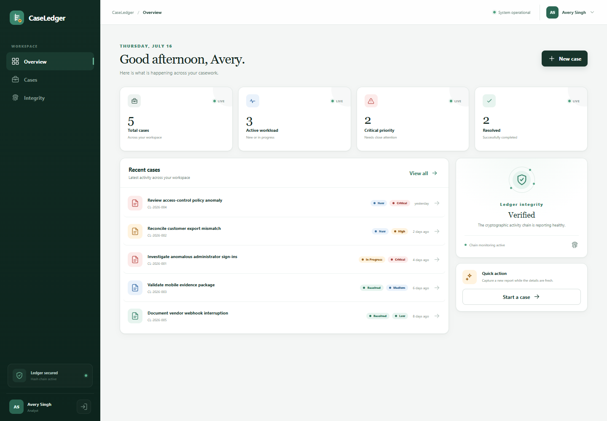
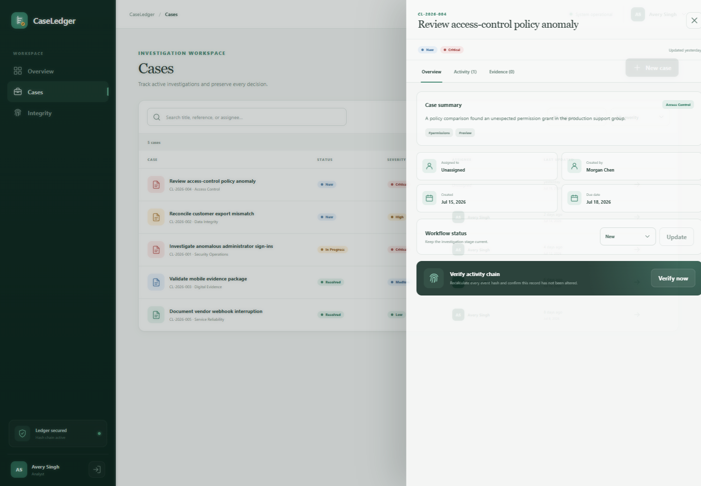
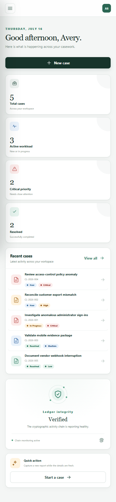
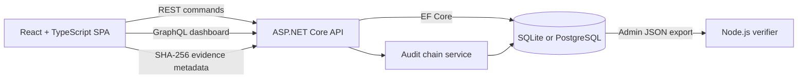

# CaseLedger

CaseLedger is a collaborative case and evidence workspace with a tamper-evident activity trail. It combines a responsive React interface, an ASP.NET Core API, REST commands, a GraphQL dashboard, relational persistence, and an independent Node.js audit verifier.

## Live demo

[Open the hosted CaseLedger demo](https://caseledger-demo.onrender.com)

Sign in with the shared analyst account:

- Email: `analyst@caseledger.dev`
- Password: `Analyst123!`

The free Render service may take about a minute to wake after inactivity. The hosted administrator credential remains private.



## What it demonstrates

- React 19 and TypeScript 6 with responsive, accessible workflow states
- ASP.NET Core 10 minimal APIs with cookie authentication and role authorization
- REST for case commands and GraphQL for dashboard aggregation
- EF Core with zero-configuration SQLite locally and PostgreSQL migrations for hosted deployments
- SHA-256 chained audit events with immutable tracked history
- Browser-side evidence hashing without retaining uploaded file contents
- An independent, dependency-free Node.js 24 audit verifier
- Integration tests covering authentication, a full case lifecycle, GraphQL, authorization, and deliberate audit tampering

## Run locally

Prerequisites:

- [.NET 10 SDK](https://dotnet.microsoft.com/download/dotnet/10.0)
- [Node.js 24 or newer](https://nodejs.org/)

From the repository root:

```powershell
npm run setup
npm run dev
```

Open `http://localhost:5173`. The first run creates and seeds a local SQLite database automatically.

| Role | Email | Password | Access |
| --- | --- | --- | --- |
| Analyst | `analyst@caseledger.dev` | `Analyst123!` | Standard case workflows |
| Administrator | `admin@caseledger.dev` | `Admin123!` locally; `Seed__AdminPassword` when hosted | Standard workflows and audit export |

These accounts are deterministic demonstration credentials, not a production identity design. Hosted deployments must provide a private `Seed__AdminPassword`; the public login screen only fills the shared analyst account.

## Core workflow

1. Sign in as an analyst or administrator.
2. Search, filter, create, assign, and update cases.
3. Add comments that become immutable activity events.
4. Register evidence metadata after the browser computes its SHA-256 digest.
5. Verify an individual case's complete activity chain.
6. Export an audit chain as an administrator and verify it independently with Node.js.



<p align="center">
  
</p>

## Architecture



REST owns mutations and detailed case reads. GraphQL has one focused purpose: assembling dashboard counts, recent cases, and the workspace integrity signal. This keeps the two API styles justified instead of duplicating the same surface.

### Audit chain

Every case mutation appends an event with a deterministic canonical payload:

```text
hash = SHA-256(previousHash + "\n" + canonicalData)
genesis previousHash = 64 zeroes
```

Each event records its sequence, previous hash, hash, actor, timestamp, event type, description, and canonical data. The API rejects tracked updates or deletes of audit rows. Verification also checks that canonical data still matches the visible event fields. The Node.js tool independently checks sequence continuity, every link, and every stored hash.

See [architecture.md](docs/architecture.md) for the data model, trust boundary, and design decisions.

## API surface

| Method | Route | Purpose |
| --- | --- | --- |
| `POST` | `/api/auth/login` | Create an HTTP-only cookie session |
| `GET` | `/api/auth/me` | Return the signed-in user |
| `POST` | `/api/auth/logout` | End the session |
| `GET` | `/api/users` | List assignable users |
| `GET` / `POST` | `/api/cases` | Search or create cases |
| `GET` / `PATCH` | `/api/cases/{id}` | Read or update one case |
| `POST` | `/api/cases/{id}/comments` | Append a comment event |
| `POST` | `/api/cases/{id}/evidence` | Register evidence metadata and digest |
| `GET` | `/api/cases/{id}/audit` | Read the activity chain |
| `GET` | `/api/cases/{id}/audit/verify` | Recalculate and verify the chain |
| `GET` | `/api/cases/{id}/audit/export` | Export a chain; administrators only |
| `POST` | `/graphql` | Query dashboard aggregates |
| `GET` | `/health` | Anonymous health probe |

Example dashboard query:

```graphql
query Dashboard {
  dashboard {
    totalCases
    openCases
    criticalCases
    resolvedCases
    integrityStatus
    recentCases {
      id
      reference
      title
      status
      severity
      updatedAt
    }
  }
}
```

Validation and authorization failures use Problem Details JSON.

## Independent audit verification

Export a case audit as an administrator, then run:

```powershell
npm run verify --prefix tools/audit-verifier -- path/to/audit-export.json
```

A valid file prints the event count and chain head. Changed content, missing or reordered sequences, broken links, malformed fields, and mismatched hashes produce a nonzero exit code.

## Verification

```powershell
npm run check
```

That single command runs:

- TypeScript lint and production frontend build
- .NET restore/build with warnings reported
- Five API integration, rate-limiting, and tampering tests
- Six independent Node.js verifier tests

## Container deployment

Docker Compose builds the SPA and API into one application image and uses PostgreSQL:

```powershell
Copy-Item .env.example .env
docker compose up --build
```

Open `http://localhost:5150`. Docker remains optional; local development uses SQLite and requires no database service.

The public demo runs on Render from an immutable GHCR image published after CI succeeds. Its PostgreSQL data is hosted by Neon.

## Repository layout

```text
apps/
  api/                  ASP.NET Core API, domain, persistence, GraphQL
  web/                  React and TypeScript interface
tests/api/              End-to-end API and tamper-detection tests
tools/audit-verifier/   Independent Node.js verifier and tests
docs/                   Architecture notes and screenshots
.github/workflows/      CI and container image publishing
compose.yaml            PostgreSQL deployment
Dockerfile              Multi-stage web/API image
render.yaml             Render Blueprint configuration
```

## Deliberate tradeoffs

- Evidence bytes are not retained. The browser hashes a selected file and sends only metadata; a production collector would hash again server-side and store content in controlled object storage.
- A hash chain is tamper-evident, not an external trust anchor. A database administrator who can rewrite the entire chain could recompute it; production hardening would periodically publish signed chain heads to separate storage.
- SQLite uses `EnsureCreated` for zero-configuration local development; hosted PostgreSQL uses checked-in EF Core migrations.
- Seeded cookie authentication keeps the workflow immediately testable. Production deployment would use an external identity provider, anti-forgery protection, secret management, and stricter cookie policy.

## License

[MIT](LICENSE)
