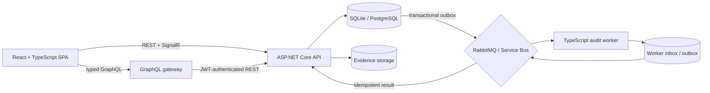

# CaseLedger

<p align="center">
  <strong>A collaborative case and evidence workspace with independently verifiable audit trails.</strong>
</p>

<p align="center">
  React · TypeScript · ASP.NET Core · GraphQL · PostgreSQL · RabbitMQ · SignalR
</p>

<p align="center">
  <a href="https://caseledger-demo.onrender.com"><strong>Live demo</strong></a>
  ·
  <a href="docs/architecture.md">Architecture</a>
  ·
  <a href="#run-locally">Run locally</a>
</p>

CaseLedger is a full-stack investigation workspace for managing cases, evidence, assignments, and activity history. Its defining feature is a SHA-256 hash chain that makes every tracked action independently verifiable rather than asking users to trust the application database alone.


## Try the demo

Open the [hosted CaseLedger demo](https://caseledger-demo.onrender.com) and sign in with:

- **Email:** `analyst@caseledger.dev`
- **Password:** `Analyst123!`

The free demo may take about a minute to wake after a period of inactivity.

### Suggested walkthrough

1. Search and filter the case workspace.
2. Open a case to review its evidence and complete activity timeline.
3. Create or update a case and see the audit trail grow.
4. Upload evidence and inspect its server-computed SHA-256 digest.
5. Run an integrity verification across the full event chain.
6. Explore the responsive layout on desktop and mobile.

## Product showcase

### Case and evidence workflow

- Responsive case dashboard with search, filtering, paging, assignments, and severity tracking
- Case details with comments, evidence metadata, file uploads, and immutable activity history
- Optimistic concurrency with strong ETags so one editor cannot silently overwrite another
- Administrator-only audit export and operational failure recovery

### Verifiable audit history

Every tracked mutation appends a deterministic event to the case ledger:

```text
hash = SHA-256(previousHash + "\n" + canonicalData)
genesis previousHash = 64 zeroes
```

Verification recalculates every hash, checks sequence continuity, validates each previous-hash link, and confirms that canonical data still matches the visible event. A separate dependency-free Node.js verifier can inspect exported chains without trusting the API that created them.

### Distributed reliability

- Transactional outbox records keep case changes and verification requests atomic
- RabbitMQ and Azure Service Bus transports support asynchronous verification
- A durable TypeScript worker uses PostgreSQL inbox/outbox tables
- Stable idempotency identifiers make duplicate requests and results safe
- Retry tiers, dead-letter handling, guarded replay, and operator audit records cover failure recovery
- SignalR pushes verification results to the UI, with polling as a fallback

### Security and platform design

- HTTP-only cookie sessions for the browser and short-lived JWTs for the GraphQL gateway
- Identity-bound anti-forgery protection for browser mutations
- Role-based authorization and optional Microsoft Entra OIDC
- Server-side evidence hashing with local and Azure Blob storage providers
- Structured Problem Details errors, rate limiting, OpenAPI, and OpenTelemetry instrumentation
- Azure Bicep and GitHub OIDC deployment assets built around managed identities and Key Vault

## Interface


<p align="center">
  
</p>

## Architecture



The ASP.NET Core API remains the source of truth for authorization, validation, mutations, audit events, and persistence. The GraphQL gateway adds a focused aggregation layer for client-facing case queries and mutations. Verification work crosses the message broker using immutable snapshots and at-least-once delivery, while inbox/outbox records and content fingerprints prevent duplicate durable effects.

Read [the architecture notes](docs/architecture.md) for the data model, trust boundaries, and design decisions.

## Technology

| Area | Stack |
| --- | --- |
| Web | React 19, TypeScript 6, Vite, Apollo Client, SignalR |
| API | ASP.NET Core 10 minimal APIs, EF Core, OpenAPI |
| Gateway | Node.js, GraphQL Yoga, DataLoader, GraphQL Code Generator |
| Data | SQLite for local demos, PostgreSQL for durable environments |
| Messaging | RabbitMQ, Azure Service Bus, transactional outbox |
| Worker | TypeScript, PostgreSQL inbox/outbox, independent hash verification |
| Testing | xUnit, Vitest, React Testing Library, Playwright, jsdom |
| Operations | Docker, OpenTelemetry, Grafana, Azure Bicep, GitHub Actions |

## Engineering highlights

- **Tamper detection:** catches modified content, broken links, missing or reordered events, and projection mismatches.
- **Conflict safety:** stale writes return the latest version instead of overwriting another user's changes.
- **Delivery guarantees:** duplicate broker messages, worker results, and webhook deliveries do not duplicate durable effects.
- **Boundary-focused GraphQL:** aggregation complements the REST API rather than duplicating domain rules.
- **Storage portability:** local development needs no external infrastructure, while hosted paths use PostgreSQL, Blob Storage, and managed messaging.
- **Automated verification:** more than 190 unit, component, integration, resilience, and tamper-detection tests, plus Docker-backed browser workflows.

## Run locally

### Prerequisites

- [.NET 10 SDK](https://dotnet.microsoft.com/download/dotnet/10.0)
- [Node.js 24+](https://nodejs.org/)

### Start the application

```powershell
npm run setup
npm run dev
```

After the API and Vite report that they are ready, open `http://localhost:5173`.

| Role | Email | Password |
| --- | --- | --- |
| Analyst | `analyst@caseledger.dev` | `Analyst123!` |
| Administrator | `admin@caseledger.dev` | `Admin123!` |

Local mode creates a disposable SQLite database automatically and uses synchronous verification, so Docker is not required for the showcase.

### Run the checks

```powershell
npm run check
```

The repository also includes Docker-backed Playwright workflows for the complete PostgreSQL, RabbitMQ, worker, webhook, replay, and deliberate-tampering path:

```powershell
npx playwright install chromium
npm run test:e2e
```

## Repository map

```text
apps/api/                  ASP.NET Core API, persistence, audit trail, outbox
apps/web/                  React and TypeScript interface
apps/graphql-gateway/      GraphQL aggregation layer
apps/audit-worker/         Durable asynchronous verification worker
tools/audit-verifier/      Independent audit-chain library and CLI
tests/api/                 API integration and tamper-detection tests
tests/e2e/                 Distributed Playwright workflows
infra/azure/               Azure infrastructure as code
docs/                      Architecture, operations, ADRs, and screenshots
```

## Design boundaries

- Hash chaining is **tamper-evident**, not an external trust anchor. A production system could periodically publish signed chain heads to separate storage.
- SQLite is intentionally disposable for local demonstrations; hosted environments use PostgreSQL migrations.
- Seeded credentials make the showcase easy to explore. Production authentication defaults them off and can use Microsoft Entra OIDC.
- The public demo keeps messaging and webhooks disabled, while the repository's Docker workflows exercise the complete distributed topology.

## License

[MIT](LICENSE)
