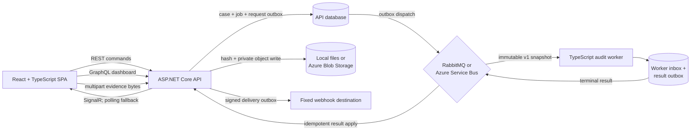

# CaseLedger

CaseLedger is a collaborative case and evidence workspace with a tamper-evident activity trail. It combines a responsive React interface, an ASP.NET Core API, REST commands, a GraphQL dashboard, relational persistence, and a durable TypeScript audit-verification worker.

## Live demo

[Open the hosted CaseLedger demo](https://caseledger-demo.onrender.com)

Sign in with the shared analyst account:

- Email: `analyst@caseledger.dev`
- Password: `Analyst123!`

The free Render service may take about a minute to wake after inactivity. The hosted administrator credential remains private. Messaging and outbound webhooks are disabled on Render, so its interface uses the synchronous verification fallback.


## What it demonstrates

- React 19 and TypeScript 6 with responsive, accessible workflow states
- ASP.NET Core 10 minimal APIs with cookie authentication and role authorization
- REST for case commands and GraphQL for dashboard aggregation
- EF Core with zero-configuration SQLite locally and PostgreSQL migrations for hosted deployments
- Page-based case queries and strong ETag optimistic concurrency for updates
- SHA-256 chained audit events with immutable tracked history
- Multipart evidence uploads with server-side SHA-256 hashing and retained object bytes
- Local filesystem and managed-identity Azure Blob evidence providers
- Transactional verification jobs and request outbox records in the ASP.NET database
- RabbitMQ locally or an Azure Service Bus provider for hosted asynchronous verification
- A TypeScript worker with a durable PostgreSQL inbox and result outbox
- At-least-once delivery with idempotency checks, retry tiers, and dead-letter handling
- SignalR verification updates with a two-second polling fallback
- Signed, retryable outbound verification webhooks with a privacy-minimal payload
- An independent, dependency-free Node.js 24 audit-verifier library and CLI
- Vitest, React Testing Library, and jsdom component tests for client workflows and accessible interactions
- OpenAPI documentation plus OpenTelemetry traces, metrics, and structured JSON logs
- Optional Microsoft Entra OIDC sign-in with explicit tenant/object-ID account linkage
- An Azure Bicep and GitHub OIDC deployment package using managed identities and Key Vault
- API integration and Playwright browser tests covering real workflows, PostgreSQL, and deliberate audit tampering

## Run locally

Prerequisites:

- [.NET 10 SDK](https://dotnet.microsoft.com/download/dotnet/10.0)
- [Node.js 24 or newer](https://nodejs.org/)

From the repository root:

```powershell
npm run setup
npm run dev
```

Open `http://localhost:5173`. The API listens on `http://localhost:5150`; its Swagger UI is at
`http://localhost:5150/swagger`, and the OpenAPI JSON document is at
`http://localhost:5150/swagger/v1/swagger.json`. The first run creates and seeds a local SQLite
database automatically. This lightweight development mode leaves messaging and webhooks disabled;
clicking **Verify now** falls back to in-process verification when the queue endpoint returns `503`.

| Role | Email | Password | Access |
| --- | --- | --- | --- |
| Analyst | `analyst@caseledger.dev` | `Analyst123!` | Standard case workflows |
| Administrator | `admin@caseledger.dev` | `Admin123!` locally; `Seed__AdminPassword` when hosted | Standard workflows and audit export |

These accounts are deterministic demonstration credentials, not a production identity design. Demo
login is disabled in the base production configuration; development, Compose, and Render enable it
explicitly. A Production environment that enables it must supply `Seed__AdminPassword` and
`Seed__AnalystPassword`, with both values kept private unless the environment is intentionally a
public demo. Microsoft Entra OIDC can instead be enabled with a strict tenant/object-ID mapping.

## Core workflow

1. Sign in as an analyst or administrator.
2. Search, filter, create, assign, and update cases.
3. Add comments that become immutable activity events.
4. Upload evidence for server-side SHA-256 hashing and object storage.
5. Verify an individual case's complete activity chain synchronously or through the durable worker.
6. Export an audit chain as an administrator and verify it independently with Node.js.


<p align="center">
  
</p>

## Architecture



REST owns mutations and detailed case reads. GraphQL has one focused purpose: assembling dashboard counts, recent cases, and the workspace integrity signal. This keeps the two API styles justified instead of duplicating the same surface.

Creating a queued verification writes the job and its immutable request snapshot to the API database
in one transaction. The worker stores each `jobId` and result atomically in its own PostgreSQL
inbox/outbox. Broker delivery is at least once: a versioned full-request fingerprint and deterministic
result IDs make duplicate requests and results safe, while conflicting reuse is rejected. RabbitMQ is the Compose default.
Azure Service Bus is the hosted alternative, and the checked-in Bicep package provisions its topic,
filtered subscriptions, identities, and role assignments. No Azure environment has been provisioned
from this repository yet.

### Audit chain

Every case mutation appends an event with a deterministic canonical payload:

```text
hash = SHA-256(previousHash + "\n" + canonicalData)
genesis previousHash = 64 zeroes
```

Each event records its sequence, previous hash, hash, actor, timestamp, event type, description, and canonical data. The API rejects tracked updates or deletes of audit rows. Verification also checks that canonical data still matches the visible event fields. The Node.js tool independently checks sequence continuity, every link, and every stored hash.

See [architecture.md](docs/architecture.md) for the data model, trust boundary, and design decisions.

## API surface

| Method | Route | Purpose |
| --- | --- | --- |
| `GET` | `/api/auth/capabilities` | Report enabled sign-in methods and whether public demo credentials may be shown |
| `POST` | `/api/auth/login` | Create an HTTP-only cookie session |
| `GET` | `/api/auth/entra/login` | Begin optional Microsoft Entra OIDC sign-in |
| `GET` | `/api/auth/me` | Return the signed-in user |
| `POST` | `/api/auth/logout` | End the session |
| `GET` | `/api/users` | List assignable users |
| `GET` / `POST` | `/api/cases` | Page and search cases, or create one |
| `GET` / `PATCH` | `/api/cases/{id}` | Read one case or update its current version |
| `POST` | `/api/cases/{id}/comments` | Append a comment event |
| `POST` | `/api/cases/{id}/evidence` | Upload multipart evidence; store bytes and a server-computed digest |
| `GET` | `/api/cases/{id}/audit` | Read the activity chain |
| `GET` | `/api/cases/{id}/audit/verify` | Recalculate and verify the chain |
| `POST` | `/api/cases/{id}/audit/verifications` | Queue an immutable verification snapshot |
| `GET` | `/api/cases/{id}/audit/verifications/latest` | Read the latest queued or terminal job |
| `GET` | `/api/cases/{id}/audit/verifications/{jobId}` | Read one verification job |
| `GET` | `/api/cases/{id}/audit/export` | Export a chain; administrators only |
| SignalR | `/hubs/cases` | Authenticated case-verification updates |
| `POST` | `/graphql` | Query dashboard aggregates |
| `GET` | `/health` | Anonymous health probe |
| `GET` | `/swagger` | Interactive Swagger UI |
| `GET` | `/swagger/v1/swagger.json` | OpenAPI v1 JSON document |

### Paging and concurrent updates

`GET /api/cases` accepts `page` (one-based, default 1) and `pageSize` (1–100, default 50). Its response contains
`items`, `total`, `page`, `pageSize`, `totalPages`, `hasNextPage`, and `hasPreviousPage`.
Search, status, and severity filters compose with paging; the React client returns to page one
when a filter changes.

Case list and detail projections include a GUID `version`. Detail reads, creates, and successful
updates also return a strong ETag. A `PATCH` must echo the current version as a quoted strong
precondition:

```http
If-Match: "11111111-1111-1111-1111-111111111111"
```

A missing header returns `428 Precondition Required`; a malformed, weak, or otherwise invalid
header returns `400 Bad Request`; and a superseded version returns `412 Precondition Failed`
with the latest ETag. The client never retries a stale mutation automatically: it explains the
conflict and reloads the latest case representation.

Example dashboard query:

```graphql
query Dashboard {
  dashboard {
    totalCases
    openCases
    criticalCases
    resolvedCases
    integrityStatus
    recentCases {
      id
      reference
      title
      status
      severity
      updatedAt
    }
  }
}
```

Validation and authorization failures use Problem Details JSON.

## Independent audit verification

Export a case audit as an administrator, then run:

```powershell
npm run verify --prefix tools/audit-verifier -- path/to/audit-export.json
```

A valid file prints the event count and chain head. Changed content, missing or reordered sequences, broken links, malformed fields, and mismatched hashes produce a nonzero exit code.

## Verification

Install dependencies once, then run the fast repository checks:

```powershell
npm ci
npm ci --prefix apps/web
npm ci --prefix apps/audit-worker
npm run check
```

That single command runs:

- TypeScript lint and a production frontend build
- Vitest/React Testing Library component and API-client tests in jsdom
- .NET build plus API contract, lifecycle, telemetry, rate-limiting, and tampering tests
- TypeScript worker contract, durability, RabbitMQ, and Azure Service Bus tests
- Independent Node.js verifier tests and signed webhook-receiver tests

The Docker-backed browser workflows are intentionally a separate command because they build the
API and worker images and start a disposable PostgreSQL/RabbitMQ stack:

```powershell
npx playwright install chromium
npm run test:e2e
```

Those Playwright tests exercise analyst login, case creation, server-side evidence hashing,
asynchronous verification, direct PostgreSQL tampering, duplicate request/result replay,
dead-letter handling for an invalid message, and one signed webhook delivery. See
[operations.md](docs/operations.md) for the local E2E and observability commands.
CI runs the fast verification job first and then these Docker-backed browser workflows in a
dependent E2E job.

## Container deployment

Docker Compose builds the API/SPA and audit-worker images, then starts PostgreSQL, RabbitMQ, and a
local signed-webhook receiver:

```powershell
Copy-Item .env.example .env
docker compose up --build
```

Open `http://localhost:5150`. The stack also exposes RabbitMQ management at
`http://localhost:15672`, worker health at `http://localhost:5152/health`, and webhook-receiver
metadata at `http://localhost:5153/deliveries`. Docker remains optional; `npm run dev` uses SQLite
and the synchronous verification fallback.

For local traces, metrics, logs, and the provisioned Grafana dashboard, add the observability
Compose overlay described in [operations.md](docs/operations.md). That stack is for development
and demonstrations only; it is not a production monitoring deployment.

The public demo runs on Render from an immutable GHCR API image selected after repository checks pass. Its PostgreSQL data is hosted by Neon. CI publishes versioned API and worker images to GHCR; the image-backed Render service is updated deliberately after a green run. Messaging and webhooks remain disabled there unless an operator explicitly provisions and configures the required infrastructure.

The production-oriented Azure package lives in [`infra/azure`](infra/azure). It defines private
PostgreSQL networking, Container Apps for the API and worker, Service Bus, private Blob containers,
Key Vault, persistent Data Protection keys, and separate user-assigned managed identities. The
manual GitHub workflow authenticates to Azure with OIDC, supports a `what-if` plan, and deploys
immutable commit-tagged images from the protected `azure-production` environment. It requires an
operator-owned Azure subscription, protected environment values, and a cost review; it has not been
run against a production subscription. Every deployment must explicitly select `Entra`, `Demo`, or
`DemoAndEntra`; the Entra path supports a one-time immutable administrator object-ID mapping so a
fresh database is usable without granting access to every identity in the tenant.

## Repository layout

```text
apps/
  api/                  ASP.NET Core API, persistence, outbox, SignalR, webhooks
  audit-worker/         TypeScript verifier worker and PostgreSQL inbox/outbox
  web/                  React and TypeScript interface
tests/api/              End-to-end API and tamper-detection tests
tests/e2e/              PostgreSQL/RabbitMQ Playwright and resilience workflows
tools/audit-verifier/   Independent Node.js verifier and tests
tools/webhook-receiver/ Local signed-delivery test receiver
docs/                   Architecture, operations, ADRs, and screenshots
ops/observability/      Local Grafana dashboard provisioning
.github/workflows/      CI and container image publishing
infra/azure/            Bicep, validation, and GitHub OIDC bootstrap package
compose.yaml            PostgreSQL, RabbitMQ, API, worker, and webhook receiver
compose.e2e.yaml        Disposable distributed browser-test stack
compose.observability.yaml  Local OpenTelemetry/Grafana overlay
Dockerfile              Multi-stage web/API image
render.yaml             Render Blueprint configuration
```

## Deliberate tradeoffs

- Uploaded evidence bytes are retained under generated case/evidence object keys and hashed by the API. There is no download endpoint, malware scanning, retention policy, or legal-hold workflow yet. The seeded sample evidence remains metadata-only.
- Local and Compose evidence objects use filesystem storage. The Render demo has no persistent object volume, so an instance replacement can leave database metadata without its uploaded bytes; Azure Blob is the intended durable hosted provider.
- A hash chain is tamper-evident, not an external trust anchor. A database administrator who can rewrite the entire chain could recompute it; production hardening would periodically publish signed chain heads to separate storage.
- SQLite uses `EnsureCreated` for zero-configuration local development; hosted PostgreSQL uses checked-in EF Core migrations.
- Seeded cookie authentication keeps local and Render demonstrations immediately testable. Production demo login defaults off; optional Entra OIDC maps only a configured tenant and immutable object ID, without email-based account linking. Cookie principals are checked against current user status and role on every request. Anti-forgery hardening and administrator-managed identity lifecycle remain future work.
- Broker and webhook delivery are at least once. Consumers use stable idempotency identifiers; an operator must monitor and replay dead-lettered work intentionally.
- The Azure deployment package is validated infrastructure-as-code, not a claim that an Azure environment has been provisioned or paid for.
- Local telemetry deliberately records bounded operational attributes, identifiers, counts, and timings—not filenames, email addresses, request secrets, credentials, or uploaded content.

## License

[MIT](LICENSE)
