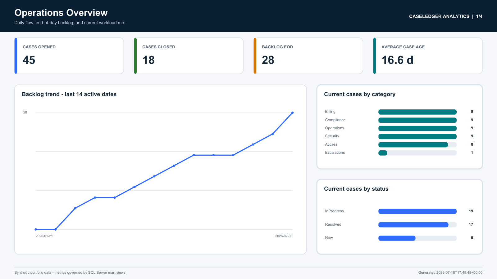
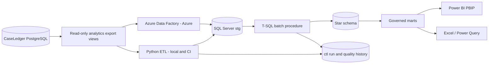

# CaseLedger Analytics

CaseLedger Analytics is the analytical companion to
[CaseLedger](../README.md). CaseLedger remains the PostgreSQL system of record;
this project extracts a privacy-minimal read model into SQL Server, applies
shared T-SQL warehouse transformations, and serves governed reporting marts to
Power BI and Excel.

## Live dashboard

[](https://app.powerbi.com/view?r=eyJrIjoiMTM2OGNmZmUtNjhkOC00ZmJiLTk2MmItMmE4NWQ4NjUxYjllIiwidCI6IjNkNmIxN2QxLWU2NGUtNGIxYS1iNjNkLWI2YzMyOGFjNWIyMiJ9)

[Open the interactive Power BI dashboard](https://app.powerbi.com/view?r=eyJrIjoiMTM2OGNmZmUtNjhkOC00ZmJiLTk2MmItMmE4NWQ4NjUxYjllIiwidCI6IjNkNmIxN2QxLWU2NGUtNGIxYS1iNjNkLWI2YzMyOGFjNWIyMiJ9)

## What is implemented

- Closed-window incremental extraction from five read-only PostgreSQL views.
- Python 3.12 orchestration with structured JSON logs, fixed high watermarks,
  durable batch history, and failure-safe watermark advancement.
- SQL Server `ctl`, `stg`, `dw`, and `mart` schemas.
- SCD Type 2 case history with exclusive `[effective_from,effective_to)` ranges.
- Case-event, daily-snapshot, and integration-delivery facts at documented grains.
- Historically correct status/backlog snapshots reconstructed from lifecycle events.
- Six shared marts and a metric catalogue consumed by both BI clients.
- Seventeen persisted reconciliation, uniqueness, completeness, validity, and
  referential-integrity checks.
- Deterministic, non-identifying source data plus full, incremental, replay, and
  failed-run scenarios.
- A metadata-driven Azure Data Factory definition and Azure Bicep deployment package.
- A Git-friendly Power BI Project with a TMDL import model and governed DAX measures.

## Architecture



Python and ADF are alternative orchestrators. Both load the same staging
contract and call `dw.usp_ProcessBatch`; they are never scheduled to own the
same environment simultaneously.

## Local demonstration

Prerequisites are Docker Desktop with Compose v2. The local stack publishes
PostgreSQL on `localhost:6543` and SQL Server on `localhost:14333`.

```powershell
docker compose up -d --build --wait
docker compose --profile tools run --rm etl demo --cases 160
```

The `demo` command creates the warehouse, replaces only the disposable Compose
source with deterministic data, runs a full load, adds an SCD change and a
late-arriving event, runs an incremental load, and replays that incremental
batch. Each summary includes the batch identifier, watermark window, counts,
quality-check total, and terminal status.

Useful commands:

```powershell
docker compose --profile tools run --rm etl bootstrap
docker compose --profile tools run --rm etl run
docker compose --profile tools run --rm etl replay
docker compose --profile tools run --rm etl simulate-failure --stage stage
```

The failure command deliberately returns nonzero. Confirm that the failed run
is recorded while `ctl.Watermark` remains on the last successful batch through
`mart.vw_ETLRunHistory`.

## Warehouse grains

| Object | Grain |
|---|---|
| `dw.DimCase` | One effective version of a case's tracked analytical attributes |
| `dw.FactCaseEvent` | One source case lifecycle event |
| `dw.FactCaseDailySnapshot` | One case at the end of one calendar day |
| `dw.FactIntegrationDelivery` | One webhook delivery attempt |

The dimensional history tracks priority (CaseLedger severity), category,
assigned user/team, service tier, status, due date, and report-facing title.
Daily snapshot status is resolved from the event history as of each day end, so
backlog cannot be rewritten by the case's current operational state.

## Incremental safety

Every run reads the prior successful watermark and captures a fixed high value.
Every export applies:

```sql
WHERE updated_at > :previous_watermark
  AND updated_at <= :high_watermark
```

The watermark advances only in `ctl.usp_CompleteETLRun`, after the warehouse
transaction and all quality checks succeed. Staging batch keys, dimension
version constraints, and fact natural-key constraints make retries and replay
idempotent. A late event uses its source creation time for extraction but its
`businessOccurredAt` value for the fact's analytical occurrence date.

## Tests

```powershell
python -m venv .venv
.\.venv\Scripts\python -m pip install -e ".[dev]"
.\.venv\Scripts\python -m pytest tests\unit
.\.venv\Scripts\python -m ruff check src tests tools
```

Docker-backed integration tests are opt-in:

```powershell
$env:CASELEDGER_RUN_INTEGRATION='1'
.\.venv\Scripts\python -m pytest tests\integration
```

CI starts clean PostgreSQL and SQL Server containers, then proves full load,
incremental load, SCD history, late-arrival placement, batch replay, quality
checks, and failed-run watermark recovery.

## BI assets

- Open `powerbi/CaseLedgerAnalytics.pbip` in a current Power BI Desktop release.
- Set the `SqlServerHost` and `SqlServerDatabase` Power Query parameters, then refresh.
- See [metric-catalog.md](docs/metric-catalog.md) for governed formulas and grains.
- See [runbook.md](docs/runbook.md) for source-role, refresh, replay, and failure procedures.

The model uses import mode for a small reproducible portfolio dataset. The
semantic model imports only `mart` views; neither Power BI nor Excel interprets
raw staging or warehouse tables independently.

## Security boundary

The PostgreSQL analytics role can select only export views. Those views omit
names, email addresses, summaries, payloads, evidence metadata, and audit
hashes; user identifiers are deterministic SHA-256 aliases. The SQL Server
reporting role can select only the `mart` schema. Local passwords are disposable
Compose defaults and can be overridden from an ignored `.env`; deployed secrets
are referenced through Azure Key Vault.

## Project map

```text
src/etl/                 Python orchestration and batch lifecycle
sql/source/              PostgreSQL export contract and local source schema
sql/{control,staging}/   Pipeline state and source-shaped staging
sql/{dimensions,facts}/  Star schema
sql/procedures/          Shared warehouse transformation
sql/marts/               Stable report views and report-reader role
tests/                   Unit and Docker integration tests
adf/                     Versioned ADF linked services, datasets, pipeline, trigger
infrastructure/bicep/    Azure SQL, Data Factory, and Key Vault resources
powerbi/                 PBIP report and TMDL semantic model
excel/                   Operations pack and refresh guidance
docs/                    Architecture, dictionary, catalogue, and runbook
```
