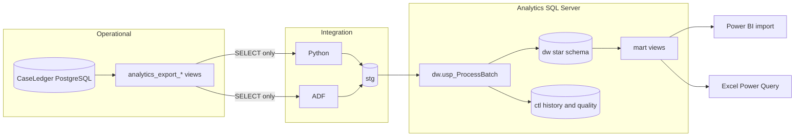
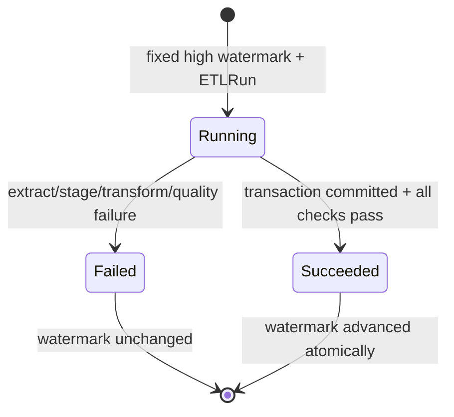

# Architecture

## Decision

CaseLedger Analytics is isolated from the operational application. PostgreSQL
remains the OLTP source of truth; the analytical project owns export views,
orchestration, SQL Server staging, dimensional history, facts, marts, and BI
metadata. This directory is intended to become the root of the separate
`caseledger-analytics` repository.

Python and Azure Data Factory are mutually exclusive environment-level
orchestrators. Both load the same source-shaped staging contract, call
`dw.usp_ProcessBatch`, call `ctl.usp_ValidateBatch`, and complete the same
control-table lifecycle.

## Trust boundaries

The source analytics account can read only export views. It cannot run the
synthetic seeder; that disposable local-only operation has a separate admin
connection. Reporting identities receive `SELECT` only on `mart` through the
`caseledger_report_reader` role.

## Source contracts

| View | Natural key | Eligibility timestamp | Privacy behavior |
|---|---|---|---|
| `analytics_export_cases` | Case UUID | Case `UpdatedAt` | Omits summary and tags |
| `analytics_export_case_events` | Event UUID | Immutable event `CreatedAt` | Omits description, actor name, and hashes |
| `analytics_export_assignments` | Event UUID | Immutable event `CreatedAt` | Carries only assignment identifier |
| `analytics_export_delivery_attempts` | Delivery UUID | Greatest delivery state timestamp | Omits payload JSON |
| `analytics_export_users` | User UUID | Greatest related activity timestamp | Replaces name/email with a SHA-256 alias |

The parent application's `Users` table has no row-level timestamps. The export
therefore uses first/last related activity as a stable portfolio-compatible
watermark. A production identity-lifecycle implementation should add auditable
user `created_at`/`updated_at` fields at the operational boundary.

## Batch state machine

The source window is open on the previous watermark and closed on the fixed
high watermark. A retry sees the same safe records. Stage primary keys include
the batch; dimension and fact uniqueness constraints protect natural grains.

## Dimensional model

`DimCase` is SCD Type 2. Effective ranges are exclusive at the upper boundary:
`effective_from <= instant < effective_to`. The filtered unique index guarantees
one current version; a quality check verifies no intervals overlap.

Daily snapshots are rebuilt historically for affected cases. For every date in
the advancing watermark window, snapshots are also recomputed for the complete
case population so the latest day cannot omit unchanged cases. Status is
resolved from the latest lifecycle status event before each day-end boundary,
so current state does not rewrite earlier backlog. Other tracked attributes
resolve through the effective case version. Late events use `CreatedAt` to enter
the incremental window but an optional canonical `businessOccurredAt` timestamp
for analytical grouping.

## Deliberate limits

- The local source schema is a minimal contract-compatible facsimile for
  repeatable integration tests; production views target the real CaseLedger
  tables.
- SQL Server `DimDate` covers 2024-01-01 through 2035-12-31. Extend it before
  loading events outside that range.
- Azure resources are deployable infrastructure-as-code, not evidence that a
  paid Azure environment has been provisioned.
- Import mode is selected for a small reproducible portfolio model; DirectQuery
  is unnecessary for this workload and would weaken offline reproducibility.
