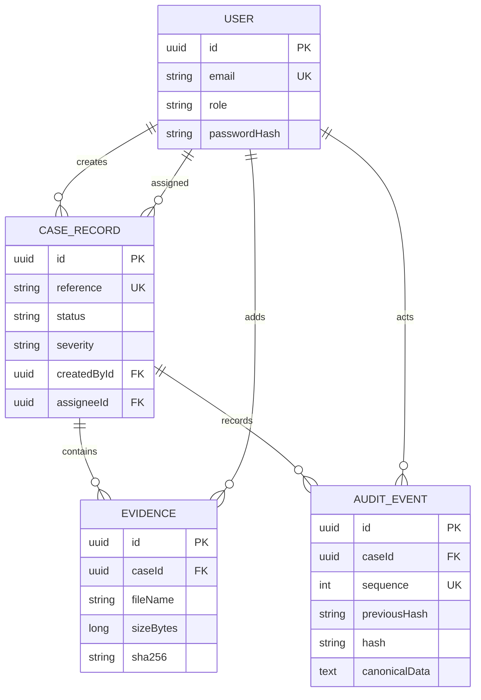
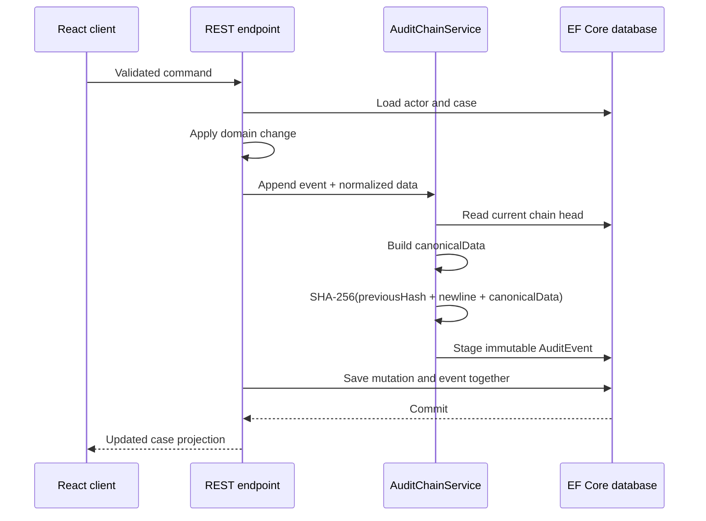

# CaseLedger architecture

## Goals

CaseLedger is designed as a portfolio-sized system with production-minded boundaries. It should start with one command, show meaningful seeded state, exercise multiple API styles for defensible reasons, and make integrity behavior testable without pretending that a hash chain is a blockchain.

Primary goals:

- Keep commands, validation, and persistence in the ASP.NET Core service.
- Give the React client a focused workflow rather than exposing database-shaped forms.
- Preserve an append-only account of every case mutation.
- Allow a second implementation to verify exported history independently.
- Run locally without infrastructure while retaining a PostgreSQL deployment path.

Non-goals include file-content storage, public registration, real-time collaboration, external notifications, and distributed services.

## Runtime components

### React client

The TypeScript client owns presentation state, accessible interactions, search/filter controls, and browser-side SHA-256 calculation for selected evidence. It calls REST for commands and details, then issues one GraphQL query for the overview.

The development server proxies `/api` and `/graphql` to the API. In the container image, the compiled SPA is copied into the API's `wwwroot` directory and served from the same origin.

### ASP.NET Core API

The API owns:

- HTTP-only cookie sessions and role claims
- request validation and Problem Details responses
- case reference allocation and domain transitions
- EF Core persistence
- canonical audit event creation
- audit verification and administrator-only export
- dashboard aggregation through GraphQL

REST endpoints use minimal API route groups. The focused GraphQL query is a separate read model rather than a second mutation surface.

### Relational database

SQLite is the default provider because it makes the first run deterministic and requires no external process. Setting `Database__Provider=PostgreSQL` and `ConnectionStrings__CaseLedger` selects Npgsql instead. Both providers use the same EF Core model.

Core relationships:

A unique `(CaseId, Sequence)` index prevents duplicate positions, and a unique case reference index protects human-readable identifiers.

### Node.js verifier

The verifier has no runtime dependencies and never contacts the API. It accepts either an export envelope or a raw event array, supports camelCase and PascalCase property names, and exits nonzero on invalid input or tampering. Keeping this verifier independent reduces the chance that verification merely repeats a shared implementation bug.

## Mutation and audit sequence

The first event uses 64 zeroes as its previous hash. Subsequent events use the exact lowercase hash of the preceding event. Canonical JSON contains version, event ID, case ID, sequence, event type, description, actor identity, UTC timestamp, and sorted event-specific data.

Verification checks:

1. sequences are contiguous from one;
2. the first previous hash is the genesis value;
3. each later previous hash equals the prior event hash;
4. every stored hash matches a fresh calculation;
5. canonical fields still match the visible event columns.

`CaseLedgerDbContext` rejects tracked audit updates and deletes. The tampering integration test bypasses that guard with direct SQL, proving that verification detects storage-level modification.

## Authentication and authorization

Passwords are stored as PBKDF2-SHA256 hashes with 120,000 iterations and fixed-time verification. A successful login creates an eight-hour, HTTP-only, same-site cookie. API authentication handlers return JSON Problem Details instead of browser redirects.

Both seeded roles can perform standard case work. Audit export is restricted to the `Admin` role; integration tests assert that an analyst receives HTTP 403.

This is intentionally a demonstration identity boundary. A production deployment should use a managed identity provider, add anti-forgery protection for cookie-authenticated mutations, require HTTPS-only cookies, rotate secrets, and implement account lifecycle policies.

## Integrity trust boundary

The chain makes accidental corruption and partial history edits visible. It does not stop a privileged database operator from rewriting every event and recomputing every later hash. Stronger deployments would sign or publish periodic chain heads to an independently controlled store.

Evidence handling has a similar explicit boundary. The browser calculates a file digest, but the service receives only the digest and metadata. A trusted production collector should hash content again server-side before durable object storage.

## Failure handling

- Invalid requests return field-level validation details.
- Missing cases return a 404 Problem Details document.
- Unauthenticated and unauthorized requests return 401 and 403 JSON responses.
- UI requests preserve loading, empty, error, and retry states.
- The dashboard falls back to a REST rollup if GraphQL is unavailable.
- The verifier reports the first invalid event and returns a nonzero status.

## Test strategy

The API tests start the real web application with an isolated SQLite file and exercise it through HTTP:

- unauthorized access and cookie login
- create, update, comment, and evidence registration
- search and detailed projections
- GraphQL aggregate results
- analyst/admin authorization differences
- JSON audit export
- tracked immutability enforcement
- raw SQL tampering detection

Node.js tests independently cover valid envelopes, PascalCase input, content changes, broken links, sequence changes, and CLI exit codes. The root `npm run check` command matches the CI workflow.

## Production evolution

The next practical steps would be reviewed EF Core migrations, external identity, server-side evidence ingestion, optimistic concurrency for case references and chain appends, pagination cursors, signed chain-head anchoring, request tracing, and deployment-specific health checks.

