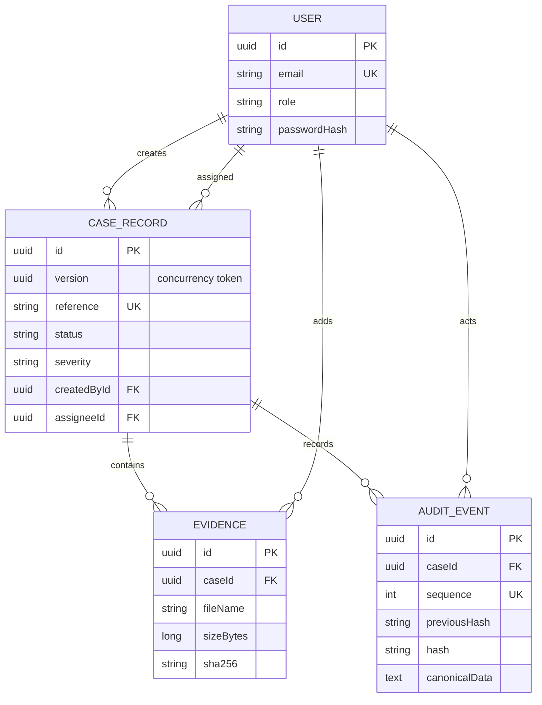
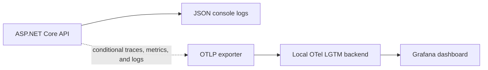
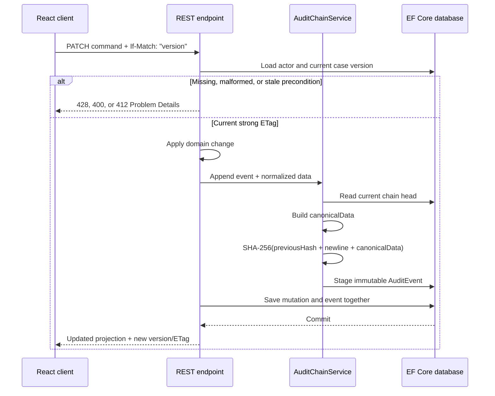

# CaseLedger architecture

## Goals

CaseLedger is designed as a portfolio-sized system with production-minded boundaries. It should start with one command, show meaningful seeded state, exercise multiple API styles for defensible reasons, and make integrity behavior testable without pretending that a hash chain is a blockchain.

Primary goals:

- Keep commands, validation, and persistence in the ASP.NET Core service.
- Give the React client a focused workflow rather than exposing database-shaped forms.
- Preserve an append-only account of every case mutation.
- Allow a second implementation to verify exported history independently.
- Reject lost updates with explicit HTTP preconditions.
- Expose operational signals without placing case content in telemetry.
- Run locally without infrastructure while retaining a PostgreSQL deployment path.

Non-goals include file-content storage, public registration, real-time collaboration, external
notifications, distributed services, and a production monitoring backend.

## Runtime components

### React client

The TypeScript client owns presentation state, accessible interactions, search/filter controls, and browser-side SHA-256 calculation for selected evidence. It calls REST for commands and details, then issues one GraphQL query for the overview.

The development server proxies `/api` and `/graphql` to the API. In the container image, the compiled SPA is copied into the API's `wwwroot` directory and served from the same origin.

Vitest runs the client component suite in jsdom with React Testing Library and `user-event`.
The tests drive controls through their accessible names and cover login outcomes, dialog focus and
Escape behavior, case creation, dashboard failure recovery, server pagination, strong ETag headers,
and stale-update handling.

### ASP.NET Core API

The API owns:

- HTTP-only cookie sessions and role claims
- request validation and Problem Details responses
- OpenAPI JSON at `/swagger/v1/swagger.json` and Swagger UI at `/swagger`
- case reference allocation and domain transitions
- page-based list projections and strong ETag preconditions
- EF Core persistence
- canonical audit event creation
- audit verification and administrator-only export
- dashboard aggregation through GraphQL
- structured JSON logs and OpenTelemetry instrumentation

REST endpoints use minimal API route groups. The focused GraphQL query is a separate read model rather than a second mutation surface.

### Relational database

SQLite is the default provider because it makes the first run deterministic and requires no external process. Setting `Database__Provider=PostgreSQL` and `ConnectionStrings__CaseLedger` selects Npgsql instead. Both providers use the same EF Core model.

Core relationships:

A unique `(CaseId, Sequence)` index prevents duplicate positions, and a unique case reference index protects human-readable identifiers.

`CaseRecord.Version` is an application-managed GUID concurrency token. EF Core assigns a new GUID
on every tracked case update. REST list/detail representations expose it, while creates and detail
responses also publish it as a strong ETag.

### Node.js verifier

The verifier has no runtime dependencies and never contacts the API. It accepts either an export envelope or a raw event array, supports camelCase and PascalCase property names, and exits nonzero on invalid input or tampering. Keeping this verifier independent reduces the chance that verification merely repeats a shared implementation bug.

### Observability pipeline

The API writes UTC JSON console logs with trace and span correlation. ASP.NET Core, outbound HTTP,
runtime, and CaseLedger business instrumentation produce traces and metrics under the
`CaseLedger.Api` source and meter. Business signals use bounded labels such as severity, media type
group, audit event type, and verification result.

The OTLP trace, metric, and log exporters are registered only when
`OTEL_EXPORTER_OTLP_ENDPOINT` is set. Without it, structured console logging remains active and no
remote export is attempted. `compose.observability.yaml` supplies a loopback-only local collector
and Grafana instance for development and demonstrations; it is not a production retention,
authentication, TLS, or alerting design.

Telemetry contains case/evidence identifiers, bounded categories, counts, sizes, and timings. It
does not contain evidence filenames, user email addresses, passwords, cookies, authorization
secrets, request bodies, or uploaded file content.

## Mutation and audit sequence

The first event uses 64 zeroes as its previous hash. Subsequent events use the exact lowercase hash of the preceding event. Canonical JSON contains version, event ID, case ID, sequence, event type, description, actor identity, UTC timestamp, and sorted event-specific data.

Creates do not require a precondition; they return the initial version and ETag. PostgreSQL
`timestamp with time zone` persists microsecond precision, while .NET `DateTime` can represent
100-nanosecond ticks. Before canonical JSON is created or an audit event is persisted, CaseLedger
converts the timestamp to UTC and truncates sub-microsecond ticks. Verification formats the stored
value through the same normalization. This keeps canonical hashes stable across SQLite and
PostgreSQL round trips rather than hashing precision the deployment database cannot retain.

Verification checks:

1. sequences are contiguous from one;
2. the first previous hash is the genesis value;
3. each later previous hash equals the prior event hash;
4. every stored hash matches a fresh calculation;
5. canonical fields still match the visible event columns.

`CaseLedgerDbContext` rejects tracked audit updates and deletes. The tampering integration test bypasses that guard with direct SQL, proving that verification detects storage-level modification.

## Authentication and authorization

Passwords are stored as PBKDF2-SHA256 hashes with 120,000 iterations and fixed-time verification. A successful login creates an eight-hour, HTTP-only, same-site cookie. API authentication handlers return JSON Problem Details instead of browser redirects.

Both seeded roles can perform standard case work. Audit export is restricted to the `Admin` role; integration tests assert that an analyst receives HTTP 403.

This is intentionally a demonstration identity boundary. A production deployment should use a managed identity provider, add anti-forgery protection for cookie-authenticated mutations, require HTTPS-only cookies, rotate secrets, and implement account lifecycle policies.

## Integrity trust boundary

The chain makes accidental corruption and partial history edits visible. It does not stop a privileged database operator from rewriting every event and recomputing every later hash. Stronger deployments would sign or publish periodic chain heads to an independently controlled store.

Evidence handling has a similar explicit boundary. The browser calculates a file digest, but the service receives only the digest and metadata. A trusted production collector should hash content again server-side before durable object storage.

## Failure handling

- Invalid requests return field-level validation details.
- Case-list paging returns stable page, page-size, total-page, and next/previous metadata.
- A missing update precondition returns 428; malformed or weak ETags return 400; stale versions return 412 with the current ETag.
- After a 412, the React client reports the conflict and reloads the current case without retrying the mutation.
- Missing cases return a 404 Problem Details document.
- Unauthenticated and unauthorized requests return 401 and 403 JSON responses.
- UI requests preserve loading, empty, error, and retry states.
- The dashboard falls back to a REST rollup if GraphQL is unavailable.
- The verifier reports the first invalid event and returns a nonzero status.

## Test strategy

The test layers have deliberately different scopes:

1. Vitest and React Testing Library exercise client behavior in jsdom, including accessible
   interactions, request headers, filters, paging, error recovery, and optimistic-concurrency UI.
2. API tests start the real ASP.NET Core application with an isolated SQLite file and exercise
   authentication, lifecycle commands, pagination metadata, OpenAPI, ETags, authorization,
   telemetry label hygiene, GraphQL, tracked immutability, timestamp precision, and raw SQL
   tampering through HTTP and the service boundary.
3. Node.js tests independently cover valid audit envelopes, PascalCase input, content changes,
   broken links, sequence changes, and CLI exit codes.
4. Playwright builds the production container and starts a disposable PostgreSQL 17 stack. It
   drives analyst login, case creation, evidence hashing/registration, successful verification,
   direct database tampering, and verification failure through a real Chromium browser.

`npm run check` runs the first three fast layers (plus lint and production builds). CI runs that
verification job first, then runs the Docker/PostgreSQL Playwright workflows in a dependent E2E
job. Locally, the browser layer remains an explicit `npm run test:e2e` command because it requires
Docker and Chromium.

## Production evolution

The next practical steps would be external identity, anti-forgery protection, server-side evidence
ingestion, signed chain-head anchoring, cursor pagination for very large datasets, managed telemetry
storage with access control and retention policies, alerting, and deeper deployment health checks.
