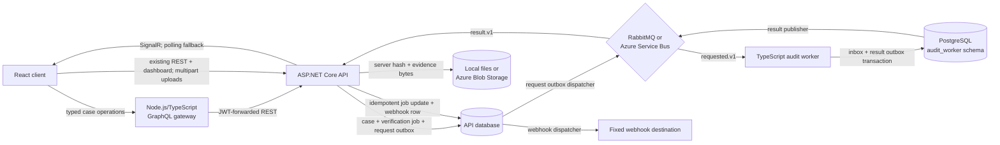

# CaseLedger architecture

## Goals and boundaries

CaseLedger keeps case commands, authorization, audit creation, and persistence in the ASP.NET Core
API, adds a narrow GraphQL aggregation boundary for clients, and keeps audit verification
independently executable and operationally observable.

Primary goals:

- preserve an append-only, tamper-evident event chain for every case mutation;
- retain uploaded evidence bytes behind generated object keys and compute their digest server-side;
- reject lost updates with strong HTTP preconditions;
- expose typed case aggregation without duplicating the complete REST API;
- support zero-infrastructure SQLite development and a PostgreSQL deployment path;
- queue immutable verification snapshots without a database/broker dual-write;
- process broker messages safely under at-least-once delivery;
- surface terminal results through SignalR with polling as a recovery path;
- send an optional, signed, privacy-minimal completion webhook;
- keep broker credentials, webhook secrets, request bodies, evidence bytes, and case content out of telemetry.

Non-goals are evidence download and malware scanning, public registration, arbitrary
user-configured webhook targets, an exactly-once delivery claim, automatic deployment without an
operator-approved Azure subscription, replacing every REST endpoint with GraphQL, and a production
monitoring backend.

## Runtime components



### React client

The React 19/TypeScript client retains the established REST workflows and .NET dashboard query. One
Apollo Client page exercises the Node gateway's typed case filtering, sorting, and pagination.
Evidence registration still sends a multipart file upload directly to the API; the browser does not
provide the authoritative digest.

When asynchronous messaging is enabled, **Verify now** creates a verification job. The client joins
the authenticated `/hubs/cases` SignalR group for that case and reloads the job after a
`VerificationUpdated` event. A pending job is also polled every two seconds, so a missed or
unavailable real-time connection does not strand the interface. If queuing returns `503` because
messaging is disabled, the client calls the synchronous `/audit/verify` endpoint instead.

### Node.js GraphQL gateway

GraphQL Yoga exposes `cases`, `case`, `investigators`, `updateCaseStatus`, and
`assignInvestigator`. The combined case resolver assembles details, events, evidence, analytics, and
integrity from existing REST resources. Request-scoped DataLoaders cache duplicate case/audit calls
and batch user directory reads, avoiding repeated upstream requests without adding a second data
store.

The gateway validates schema inputs before contacting REST and maps expected upstream failures to
stable GraphQL error codes. It verifies short-lived HMAC JWTs issued by the API, applies resolver
role checks, and forwards the bearer token so the ASP.NET Core API remains the final authorization
boundary. GraphQL Code Generator produces resolver and Apollo operation types from the checked-in
schema. Subscriptions, federation, and a duplicate persistence layer are intentionally absent.

### ASP.NET Core API

The API owns cookie sessions and role claims, short-lived gateway JWT issuance, identity-bound
anti-forgery validation, Problem Details responses, case validation and ETag preconditions, EF Core
persistence, audit creation, the existing GraphQL dashboard aggregate, OpenAPI, structured logs, and
OpenTelemetry instrumentation. The anonymous antiforgery endpoint pairs a request token with an
HTTP-only cookie; every unsafe cookie-authenticated request requires the matching header. Bearer
requests use JWT validation instead. The React client and bundled Swagger UI obtain antiforgery
tokens automatically, including after the authenticated identity changes.

Evidence uploads are streamed through a bounded temporary file while the API computes SHA-256 and
the actual byte count. The API then writes the object before committing its evidence row and audit
event. If the database operation fails, the staged object is removed. This is compensating cleanup,
not a distributed transaction between the relational database and object store.

The default provider writes beneath a configured local root with generated
`cases/{caseId}/evidence/{evidenceId}.blob` paths and traversal checks. The Azure provider writes the
equivalent generated key without the suffix to a private Blob container using
`DefaultAzureCredential`; it records the digest and size as blob metadata and rejects an overwrite.
Filenames never form an object key. Download, malware scanning, retention, and legal-hold workflows
are outside the current surface.

`POST /api/cases/{id}/audit/verifications` builds a strictly shaped, immutable v1 snapshot and stages both an
`AuditVerificationJob` and its `OutboxMessage`. The endpoint calls `SaveChanges` once, so the job and
publish intent commit atomically. A background dispatcher leases pending outbox rows and publishes
through the configured broker provider.

The result consumer validates the v1 contract, job identity, case identity, verification profile,
and snapshot digest. Applying the first terminal result updates the job and, when enabled, stages
one `WebhookDelivery` in the same database transaction. A repeated matching `resultId` is treated as
a duplicate; a conflicting result is rejected.

### Relational persistence

SQLite is the zero-configuration API default. `Database__Provider=PostgreSQL` selects Npgsql and
checked-in migrations. The Compose and E2E stacks use PostgreSQL 17.

Important persistence invariants include:

- unique case references and `(CaseId, Sequence)` audit positions;
- application-managed GUID case versions for strong ETags;
- immutable tracked `AuditEvent` rows;
- unique terminal verification `ResultId` values;
- one webhook delivery per verification job and result;
- leased API outbox and webhook rows for safe concurrent dispatch;
- one durable operator replay record per failure kind, source ID, and observed dead-letter time;
- a separate worker-owned `audit_worker` PostgreSQL schema.

The worker transaction inserts a `jobId` inbox row and deterministic result-outbox row together.
The inbox stores a versioned fingerprint of the full immutable request, the separate projection
digest returned to the API, and the cached terminal result. Repeating the same request reuses that
result; reusing the ID with any different intent or content is dead-lettered. Rows created before
the full-request fingerprint migration fail closed on reuse.

### TypeScript audit worker

The Node.js 24 worker validates the strict request schema, verifies the event projection with the
independent audit-verifier library, and persists a terminal result before acknowledging the request.
Its health endpoint reports database readiness, broker readiness, and the selected provider.

Invalid JSON, invalid contracts, oversize messages, and idempotency conflicts are terminal and go
directly to a dead-letter destination. Infrastructure failures use 5-second, 30-second, and
5-minute retry tiers. After those tiers are exhausted, the worker stores a deterministic terminal
error in its result outbox before dead-lettering the request.

### Broker providers

RabbitMQ is the local and E2E default. Durable exchanges and queues carry request, retry, result,
and dead-letter traffic. Requests use manual acknowledgements; results use publisher confirms and
the durable worker outbox.

Azure Service Bus is an implemented provider. The checked-in Bicep package provisions:

1. one topic shared by request, retry, and result messages;
2. a worker request subscription whose correlation rule matches `Subject` to
   `caseledger.audit.verification.requested.v1` (SQL equivalent:
   `sys.Label = 'caseledger.audit.verification.requested.v1'`);
3. an API result subscription whose correlation rule matches `Subject` to
   `caseledger.audit.verification.result.v1` (SQL equivalent:
   `sys.Label = 'caseledger.audit.verification.result.v1'`).

The subscriptions do not retain an unfiltered default rule. Both consumers use PeekLock with
automatic completion disabled. Valid work is completed explicitly, rejected contracts are
dead-lettered with sanitized reasons, and infrastructure failures are abandoned. Worker retries are
scheduled topic messages with a unique broker message ID per attempt while the application `jobId`
remains stable.

Provider selection is configuration-only. The API reads `Messaging__Provider` and its provider
section; the worker reads `BROKER_PROVIDER` and the corresponding broker variables. Local connection
strings remain supported, while Azure uses a fully qualified namespace and separate user-assigned
managed identities for send/receive access. The API rejects a queued snapshot larger than the
configured serialized payload ceiling before it creates job or outbox rows. The Azure Standard
template sets that ceiling to 192 KiB, below the broker's 256 KiB limit.

### Signed outbound webhook

Webhooks have one operator-configured destination; case users cannot supply a target URL. The API
stores the exact UTF-8 JSON body before dispatch and sends these headers:

- `X-CaseLedger-Delivery`
- `X-CaseLedger-Event`
- `X-CaseLedger-Timestamp`
- `X-CaseLedger-Signature`
- `Idempotency-Key`

The signature is a lowercase HMAC-SHA256 over `timestamp + "." + rawBody`, prefixed with `v1=`.
Receivers should verify the raw bytes, reject stale timestamps, and deduplicate by delivery ID.

The payload contains only `deliveryId`, `resultId`, `jobId`, `caseId`, `status`, `valid`,
`checkedEvents`, `brokenAt`, `chainHead`, `errorCode`, and `completedAt`. It does not include case
titles, descriptions, evidence metadata, actors, credentials, or the audit snapshot. A 2xx response
completes delivery. Network failures, timeouts, 408, 429, and 5xx responses retry with bounded
exponential delay; other 4xx responses and exhausted attempts are terminal. Redirects are disabled,
and response bodies are not read or stored.

## Audit integrity

Every mutation appends an event with a deterministic canonical payload:

```text
hash = SHA-256(previousHash + "\n" + canonicalData)
genesis previousHash = 64 zeroes
```

The event records its ID, case ID, sequence, type, description, actor identity, UTC timestamp,
previous hash, hash, and canonical data. PostgreSQL timestamps are normalized to microsecond
precision before canonicalization so hashes survive database round trips.

Synchronous and worker verification both check contiguous sequences, the genesis link, every later
link, every stored hash, and agreement between visible event columns and canonical data. The worker
request also carries a framed SHA-256 digest over the complete visible projection. This detects a
direct edit to fields such as `Description`, not only edits to stored hash columns.

The chain is tamper-evident, not an external trust anchor. A database administrator able to rewrite
the entire chain could recompute it. A stronger deployment would periodically sign or publish chain
heads to independently controlled storage.

## Delivery semantics

Delivery is intentionally at least once across each network boundary:

| Boundary | Durable state | Duplicate protection | Failure path |
| --- | --- | --- | --- |
| API to broker | API request outbox | message/job ID | exponential publish retry, then outbox dead-letter state |
| Broker to worker | worker inbox | `jobId` plus versioned full-request fingerprint | three retry tiers, then broker DLQ and terminal error result |
| Worker to broker | worker result outbox | deterministic `resultId` | leased exponential publish retry |
| Broker to API | verification job | validated `resultId` and result fields | invalid result DLQ; infrastructure requeue/abandon |
| API to webhook | webhook delivery outbox | delivery ID and unique job/result indexes | retryable status policy, then webhook dead-letter state |

Exactly-once side effects are not assumed. A process can publish successfully and stop before
marking its outbox row, so every downstream consumer must remain idempotent.

The Admin Operations surface lists only redacted API-owned request-outbox, terminal verification,
and webhook failures. Request and webhook replay require the exact observed dead-letter timestamp,
an eligible non-terminal source row, no active lease, and an operator reason. The transaction keeps
the original message/delivery ID and payload, resets its retry budget, and inserts an
`OperationalReplay` audit row containing the actor and previous failure state. Terminal worker jobs
are immutable and non-replayable; a new verification must use a new job. Broker-native request and
result DLQs remain owned by RabbitMQ or Azure Service Bus because malformed or conflicting messages
can poison-loop if replayed blindly.

## Authentication, key protection, telemetry, and privacy

Passwords use PBKDF2-SHA256 with per-password random salts and fixed-time verification. Successful
login creates an eight-hour, HTTP-only, same-site cookie. Both seeded roles can perform case work;
audit export requires `Admin`. Demo login is disabled in the base production configuration and is
enabled explicitly by development/demo manifests. When enabled in Production, both seeded
passwords must be supplied through configuration; disabling it rotates the stored demo hashes and
prevents local login. Public credential hints are a separate capability enabled only by deliberate
demo manifests. Cookie principals are revalidated against the current active/local-login state on
every request, and changed roles replace and renew the session principal.
Unsafe browser requests also require a matching `X-CSRF-TOKEN` header and HTTP-only, SameSite=Strict
antiforgery cookie. Tokens are identity-bound, so the client reacquires one after login before its
next mutation.

An authenticated cookie session can request a short-lived JWT with the user's immutable ID, role,
issuer, and audience. The Node gateway validates that token and forwards it to REST; the API then
revalidates the bearer principal on every upstream call. Production requires an explicitly supplied
signing key shared only between these two services.

Optional Microsoft Entra OIDC validates the configured tenant and resolves a session only through
the immutable `(tenant ID, object ID)` external-identity mapping. It never links by an email or
display-name claim. Automatic provisioning is opt-in and can create only an active, external-only
`Analyst`; otherwise an existing mapping is required. The Azure path can create one immutable
tenant/object-ID mapping to the seeded administrator during first startup, and refuses to silently
replace a conflicting mapping. The API converts the external principal into the same application
cookie used by the rest of the authorization surface. Provider or authorization failures return to
a fixed local error state rather than reflecting remote details.

For Azure revisions, the cookie Data Protection key ring is persisted to a dedicated Blob object
and encrypted with a versionless Key Vault RSA key. The API managed identity receives the scoped
Blob and cryptographic permissions, allowing sessions to survive Container App revisions without
embedding storage keys or vault credentials.

The API always emits UTC structured console logs. OTLP trace, metric, and log export is registered
only when `OTEL_EXPORTER_OTLP_ENDPOINT` is present. Telemetry uses bounded operational attributes
and excludes evidence filenames, user email addresses, passwords, cookies, broker/webhook secrets,
message bodies, and uploaded content.

## Deployment modes

| Mode | Database | GraphQL gateway | Messaging/webhook behavior |
| --- | --- | --- | --- |
| `npm run dev` | SQLite | Local Node process | Disabled by default; UI uses synchronous verification fallback |
| Docker Compose | PostgreSQL | Container on port 5155 | RabbitMQ worker and signed local webhook receiver enabled |
| Render demo | Neon PostgreSQL | Not deployed | Disabled by default; UI keeps synchronous fallback |
| Azure deployment package | Private PostgreSQL | Not yet included | Bicep configures Service Bus, Blob, Key Vault, managed identities, API and worker; package is not provisioned yet |

## Test strategy

1. Vitest and React Testing Library cover accessible client workflows, Apollo rendering, gateway
   token reuse, API parsing, SignalR reconnection/subscription, polling, and synchronous fallback.
2. Gateway integration tests execute the Yoga schema against a controlled REST server and cover
   authentication, validation, role authorization, error mapping, aggregation, and DataLoader reuse.
3. API integration tests cover lifecycle commands, ETags, OpenAPI, authorization, audit tampering,
   transactional scheduling/outbox behavior, RabbitMQ and Service Bus result handling, idempotent
   result application, SignalR notification, and webhook signing/retry decisions.
4. Worker tests cover strict contracts, cross-runtime snapshot digests, durable inbox/outbox
   behavior, RabbitMQ topology, Service Bus settlement and scheduled retries, idempotency conflicts,
   retry exhaustion, and health state.
5. Playwright uses disposable PostgreSQL, RabbitMQ, API, gateway, worker, and webhook-receiver containers. It
   covers a successful distributed workflow with server-hashed evidence, direct audit-row tampering, duplicate request/result
   replay without duplicate state or webhook delivery, and dead-lettering an invalid request.

`npm run check` runs the fast layers; `npm run test:e2e` runs the Docker-backed browser and
resilience suite.

## Decisions

- [ADR 0001: Durable asynchronous audit verification](adr/0001-durable-audit-verification.md)
- [ADR 0002: Broker provider boundary](adr/0002-broker-provider-boundary.md)
- [ADR 0003: Fixed signed completion webhook](adr/0003-fixed-signed-webhook.md)
